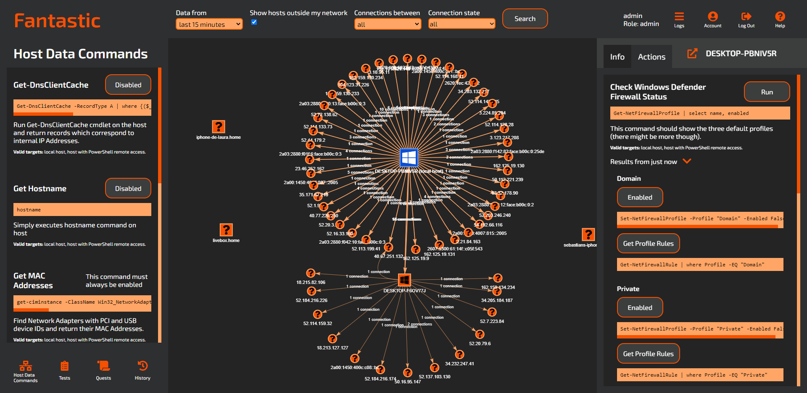

# Fantastic Full Source Code

## About

Fantastic is a visualizing tool made by [InfoSec Innovations](https://www.infosecinnovations.com/) for exploring computer networks. It aims to provide a way for network security novices and professionals alike to find and fix security issues. If you don't know where to start, the quest system (work in progress!) will guide you, or you can ignore it and try out the various options by yourself.

## Installation

- We'll only be supporting Windows 10 for the forseeable future, but other platforms may be added if there's a demand for it.
- If you don't have git cli installed you will need that first. You can install it using [Chocolatey](https://chocolatey.org/packages/git) or [GitHub Desktop](https://desktop.github.com/).
- Clone the repository and run `npm i` inside the repository root. Please ignore the messages saying you should commit the lockfiles (see [Known Issues](#known-issues) below).

## Getting started

If you just want to start the server, navigate to the `server` directory and run `npm start` as administrator. Closing the window will stop the server.

Using the default configuration you will be able to see the client at http://localhost:5000 in your browser, and you can log in as `admin` using the password `changeme`. Please change this password or use a different authorization module (feature coming soon!) as accessing the tool as admin allows you to perform some actions which should be used responsibly.

Using the default self signed certificate bundled with the app will cause warnings in the browser, but you can safely ignore these. If you want to use your own certificate, just create the `server/cert` directory with files named `cert` and `key`, please don't put it anywhere else as that may result in you committing your private key to GitHub!

**You do not have to build the client**, however the front end has 2 different directories: `front/main_interface` and `front/node_viewer`, the Node Viewer being the tab which breaks out from the main interface when you want to inspect a single host. These are already built and can be found in the `server/src` directory, however if you wish to build them again, navigate to the appropriate directory and run `npm run js` which will rebuild any changes as you make them.

Currently supported browsers:
  - Google Chrome
  - Mozilla Firefox

Currently unsupported browsers:
  - Microsoft Edge

Status of other browsers is unknown at this time.

For more information on using the application itself:
- [Getting Started With The Server](server/src/help/starting_server.md)
- [Client Help](server/src/help/index.md)

**PLEASE NOTE: a lot of the documentation is out of date because the project is still changing a lot, we're trying to keep this README relevant, but there's no guarantee regarding the other docs until the project is a bit more stable.**

## Known issues

- Attempting to run `npm i` after the project has already been installed results in errors. A workaround that seems to solve this is to delete all node_modules directories and all package-lock.json files from the project directory (just skip any that can't be deleted, this is due to symlinks). Alternatively, try deleting the whole repo and cloning it again.

## Contributing

If you wish to propose modifications to the project, please create a branch or fork to work on the proposed changes and submit a pull request when you're ready. We don't want unapproved changes to master, thanks!

Please contact [Mick](https://github.com/besimorhino) or [Sebastian](https://github.com/sebovzeoueb) if you need more information about the project.