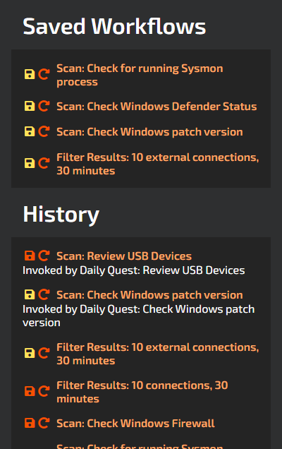

# Fantastic Help

Fantastic is a visual tool to explore a computer network, analyze security flaws, and help fix them.

## Quick Start

Once the server is up and running, connect to the server's address and port (the default is 5000) and you should be greeted by the application's interface.

If you're using the supplied default authentication module you can simply enter a username and password and click register to create an account with basic access, or use the default admin account which has the username `admin` and the password `changeme`. We recommend changing the admin password if other people have access to the tool!

Currently supported browsers:
  - Google Chrome
  - Mozilla Firefox

Currently unsupported browsers:
  - Microsoft Edge

Other browsers haven't been tested yet.

By default Fantastic runs a set of commands that are considered "safe", meaning that they don't have any possibility of interfering with other hosts on your network. Note that this is no longer guaranteed once you start enabling other data sources or adding your own.

When first entering the interface, you are viewing data from the past 15 minutes. Each node of the graph represents a host, and the arrows between them indicate connections. If you click on a node you can see more detailed information about it.

## Search Bar

At the top of the screen you can change the filtering options for the data you wish to view.

- **Data from** allows you to select the timeframe. Note there can be a very large amount of data when viewing more than a few minutes of history.
- **Show hosts outside my network** toggles hosts from outside your network that hosts inside your network are connected to.
- **Connections between** can be used to filter out internal connections within the same host.
- **Connection state** provides filtering based on the state of the connections, this can be very useful to strip down the amount of data you're looking at.

## Network Graph

A visual representation of the network. Each node represents a host, and the arrows show the connections between them. Clicking on a node or a connection opens the info panel where you can view more detailed information about it and perform actions if they are available. Hold shift to select multiple nodes. Note that "local host" refers to the server hosting the application, and not your own machine, which may not be the server.

## Network Menu

In the bottom left of the interface there are buttons to open the Host Data Commands, Tests, Quests and History panels

### Host Data Commands

Here you can see all the available commands for getting data, and you can enable or disable them if permitted. Enabled commands will run constantly on the server and update the database. These settings affect all users, so use with care!

### Tests

Tests run some actions and allow you to analyse the results according to the parameters you set. Tests, unlike quests, operate on the hosts currently visible on the network graph. Upon completing the test, if any hosts didn't pass, they will be selected.

### Quests

You will be assigned daily quests which show you some tests you can run with specific parameters, and explain why you should run them. We currently only have one quest available, but more are on their way soon. All hosts on the network must pass the test to succeed the quest. Quests select their targets from all the available data, not your current search query, so when the quest completes the graph updates to show the hosts that were scanned.

### History

View the last actions you took, save them to your favorites and run them again.

## Selection Panel

Shows information and actions related to the selected items on the graph. The button next to the host name in the top right of this panel allows you to open both views at once in a new tab. If more than one host is selected you can open each one in a new tab provided you have disabled pop-up blocking in your browser.

### Info View

When a host is selected, the connections list shows connections originating from that host. You can see the name of the process which created the connection, as well as its state. When a graph edge is selected you can see the detail of all the connections between the two hosts. With more than one host selected, you will get a list with some basic data, and you can click on the host name to select it.

### Actions View

Here you can interact directly with the selected host(s). Currently our actions can only run on the server itself and hosts with PowerShell remote access from the server, but we plan to expand this in the future. When you run an action, you will get a result, which sometimes contains further actions you can execute as a consequence of the initial one. Running actions on multiple hosts will attempt to open a new browser window for each one.