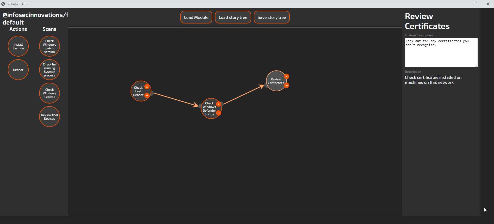

# Story Quests

Story Quests are a way to combine Scans and Actions in a meaningful way that should guide the user on a journey towards improved security. While you can edit the JSON directly, using the Fantastic Editor is strongly recommended to create Stories.

We haven't got round to packaging and distributing the Editor as a standalone executable yet, so you'll have to run it in development mode as described in the [README](https://github.com/InfoSecInnovations/project-fantastic/blob/master/README.md).

Once in the Story Tree Editor use the Load Module button to add potential story nodes to the left hand panel, and simply drag the ones you want to use onto the tree. 

The arrow icon allows you to create connections between the nodes, and the X icon will remove nodes.

The right hand panel shows you the Quest's configuration, or that of an individual node if one is selected.

Once you've created the Story Tree, save it to the `stories` directory of your module for it to be usable in Fantastic.

